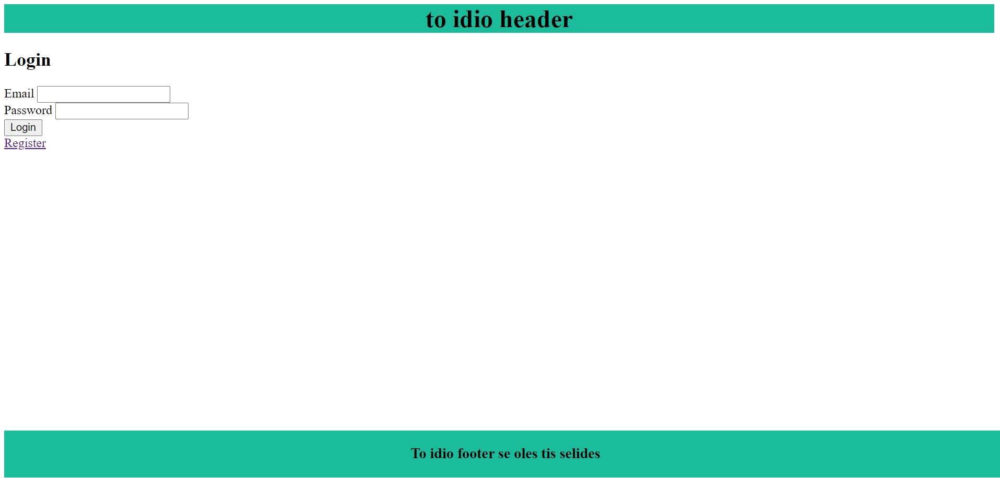
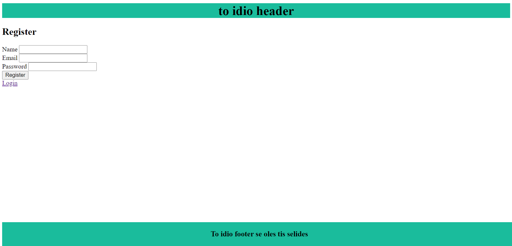
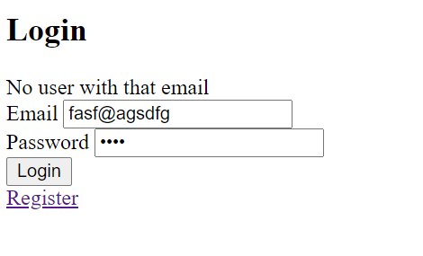
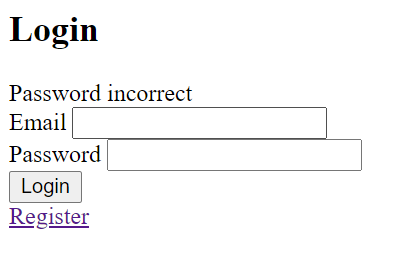
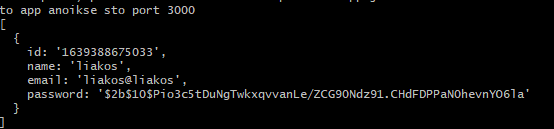

# User Registration & Login systems in Node.js with NO DB

## Getting Started

The project is [live](https://registerloginsxoli.herokuapp.com/login) on: 🌍 https://registerloginsxoli.herokuapp.com/login 

- ## Home Page

If the user has been registered on the app, can login by passing the credentials.



- ## Register

Allows the user to register their account by filling their Email, Username, Password.



- ## No user with that email

Error message when trying to log in using an unregistered email.



- ## Wrong Password

Error message when trying to log in with the incorrect password.



- ## Hashed Password

We're using a bcrypt to hash the passwords.



## Installing

```
npm install
```

## How To Run The App

```
node app.js
```

###### The server will start running on
- [localhost:5000](http://localhost:5000)
